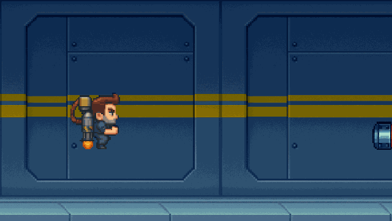

# JetPack Guy

Recriação em pixel art do *Jetpack Joyride* com **WebGL puro** — sem bibliotecas, sem bundler. Nasceu como trabalho de Computação Gráfica (UnB) e foi evoluído para peça de portfólio, com foco em arquitetura, UX/UI e design system.

[](https://Lucas-Balduino.github.io/JetPackGuy/)

**[▶ Jogar agora](https://Lucas-Balduino.github.io/JetPackGuy/)** · [Design System](https://Lucas-Balduino.github.io/JetPackGuy/design.html)



## Como funciona a renderização

Cada sprite é um JSON de pixels (`{ x, y, color }`). Em vez de texturas ou quads, **cada pixel vira um vértice** desenhado com `gl.POINTS`. O vertex shader posiciona o ponto em clip space e aplica a translação da entidade:

```glsl
attribute vec2 coordinates;
attribute vec4 aColor;
uniform vec2 translation;
uniform float isBackground;
varying vec4 vColor;

void main(void) {
    vec2 pos = coordinates;
    if (isBackground < 0.5) {
        pos = vec2(coordinates.x, -coordinates.y);
    }
    gl_Position = vec4(pos + translation, 0.0, 1.0);
    vColor = aColor;
    gl_PointSize = 4.0;
}
```

O uniform `isBackground` controla a inversão de Y: sprites do personagem/obstáculos precisam dela; o fundo, não. A proposta pedagógica do projeto é manter essa pipeline de pontos — não converter para texturas.

## Design System

Tokens (cores, tipografia, espaçamento, z-index), componentes reutilizáveis (`.btn-pixel`, `.panel-pixel`, overlays) e um styleguide navegável.

**[Abrir o Design System →](https://Lucas-Balduino.github.io/JetPackGuy/design.html)**

Arquivos: `src/styles/tokens.css`, `src/styles/components.css`, `design.html`.

## Arquitetura

```
src/
├── main.js        # ponto de entrada: liga renderer, assets, entidades, estado, input e loop
├── config.js      # constantes de tuning (CONFIG congelado)
├── renderer.js    # pipeline WebGL: shaders, buffers, drawSprite / drawPoints
├── assets.js      # fetch/parse dos JSONs de pixels e fallbacks
├── entities.js    # player, obstáculos, hitboxes e colisão AABB
├── state.js       # máquina de estados (READY, PLAYING, PAUSED, GAME_OVER)
├── input.js       # teclado, clique e toque (callbacks)
├── audio.js       # efeitos sintetizados (Web Audio API) e preferência de mudo
├── particles.js   # partículas de propulsão do jetpack
├── storage.js     # recorde em localStorage
└── styles/
    ├── tokens.css
    └── components.css
```

## Como executar localmente

Servidor local é obrigatório — o `fetch` dos JSONs falha em `file://`:

```bash
git clone https://github.com/Lucas-Balduino/JetPackGuy.git
cd JetPackGuy
npx serve .
```

Abra o endereço indicado no terminal (em geral `http://localhost:3000`).

### Controles

| Ação | Entrada |
| --- | --- |
| Voar | `Espaço` · `↑` · clique · toque |
| Pausar | `P` · botão de pausa |
| Mudo | botão 🔊/🔇 |
| Reiniciar | `Espaço` / clique / botão na tela de morte |

## Próximos passos

O roadmap das 8 fases (higiene → bugs → módulos → performance → design system → UX → game feel → vitrine) está em [`ROADMAP.md`](ROADMAP.md). Com a Fase 7 concluída, próximos passos naturais:

- Polir arte e níveis (novos obstáculos / power-ups)
- Expandir o design system com mais componentes documentados
- Gravações e screenshots adicionais para o portfólio

## Licença

MIT — ver [LICENSE](LICENSE).

---

Feito por Lucas Gonçalves Balduíno, Augusto Sodré Carneiro Lima e Luana Ferreira Veloso Lima · [GitHub](https://github.com/Lucas-Balduino)
